# SuperKEKB BT Tracking and DA Comparison as an approximation for injection efficiency 

As an upgrade to the electron transfer line at SuperKEKB (BTe) a new Energy compression system (ECS) was installed in the summer of 2025. The ECS consists of four consecutive RF cavities.

Any optimisation of BT using full multiturn injection simulations can be computationally expensive and time costly.

In an attempt to reduce computational resources/time in optimising BTe with the new ECS, this project aims to directly compare the tracked beam at the end of BTe (INJP) to the dynamic aperture (DA) of the ring (HER) lattice provided from xsuite simulations.

 This provides a quick optimisation tool for BT in terms of a first order approximate injection efficiency. 
 
 It includes tools for handling radiation, tapering, and injection types (betatron, synchrotron, or hybrid), as well as for calculating action amplitudes and survival fractions. The septum is also included in the comparison.

## MAIN FEATURES 

- Converts BTe (and BTp) of SuperKEKB from SAD to Xsuite using the SAD2XS converter

- Tracks a given input beam distribution (from LINAC ELEGANT/OCELOT) through the SuperKEKB BTE lattice.

- Computes reference frame transforms for injection bumps.

- Compares tracked beam amplitudes to DA boundaries.

- Optimises ECS lag and voltage in order to maximise survivability within the DA

Includes options for:

- Radiation (ON/OFF): enables quantum radiation at each required element to be included in the tracking

- Local momentum tapering (ON/OFF): enables local tapering of the line in order to take into account energy loss along the line and avoid significant orbit

- Emittance blowup along the line: enables emittance blowup at the end of the line in order to adjust accoriding to measured values

- Injection type (betatron, synchrotron, hybrid)

## Benchmarking and tracking particles through BTe and BTp

In order to ensure valid conversion from the SAD to the Xsuite BTe and BTp lattices were compare. 

For lattice benchmarking in 4D:

- 001_convert

> 001_convert_btp_4D.py               #BTP

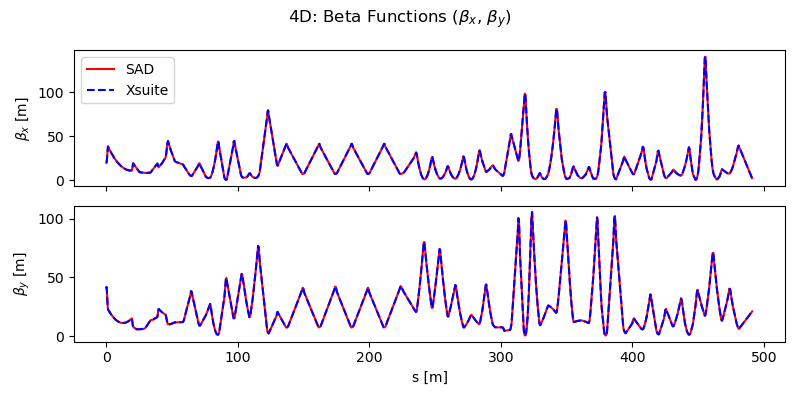 

> 002_convert_bte_4D.py               #BTE

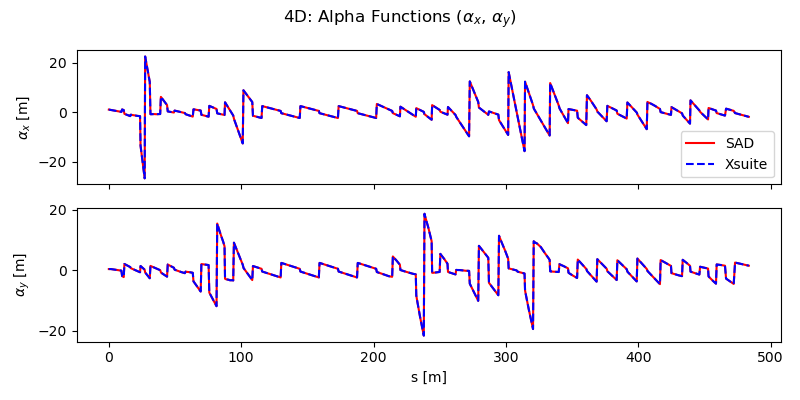 

For lattice benchmarking in 6D:

- 001_convert
> 003_convert_btp_6D.py    #BTP

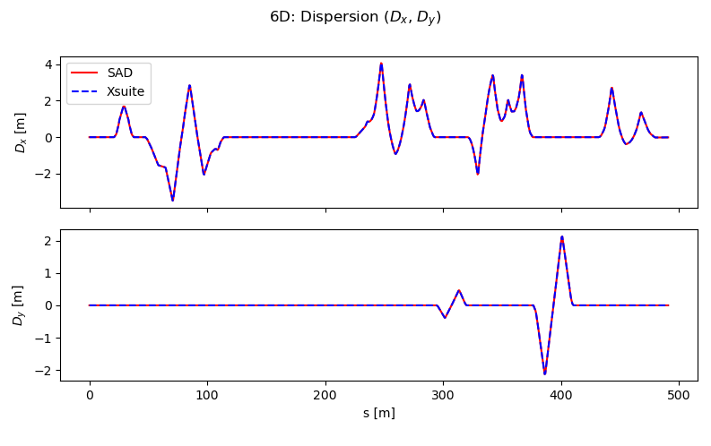
    
> 004_convert_bte_6D.py    #BTE

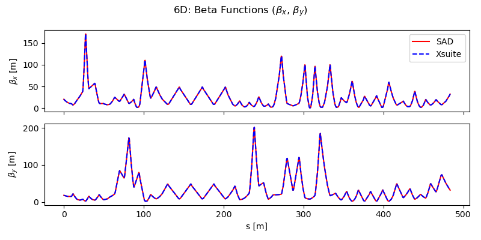 

For an example of SAD tracking:

- 002_track_sad_gaussian  
> 001_track_btp.sad                #BTP

> 002_track_bte.sad                #BTE

For particle tracking comparisons between SAD and Xsuite:

- 003_track_xs_gaussian  
> 001_track_btp_sad_init.py        #BTP

> 002_track_bte_sad_init.py        #BTE

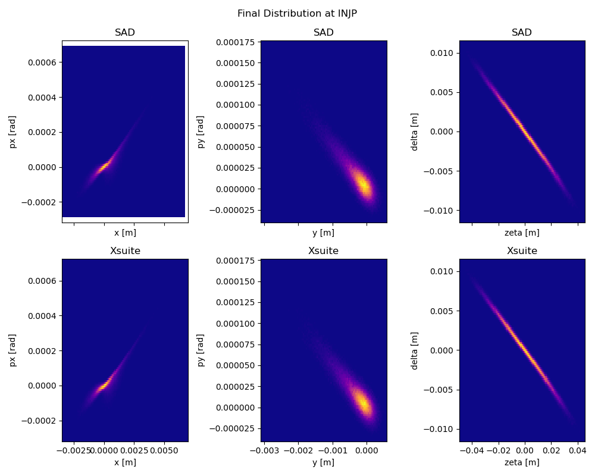

For particle tracking in Xsuite (generating random Gaussian distribution)
- 003_track_xs_gaussian   
> 003_track_btp.py                 #BTP

> 004_track_bt4.py                 #BTE

For particle tracking with a from OCELOT generated input distribution in Xsuite:

N.B.: Zeta coordinate in Ocelot is defined with opposite sign to Xsuite

- 004_track_xs_input_dist

> 001_track_btp.py                 #BTP    

> 002_track_bte.py                 #BTE

## FILE SPECIFIC FEATURES ##

Features of  _001_phasespace.py_ : 
### User parameters
    Radiation = True          # Enable radiation effects

    Tapering = True           # Enable momentum tapering

    aperture_checks = True    # Enables apertures in the line
    
    ECS_voltage = 50          # ECS voltage in MV (None = default 18 MV)
    ECS_lag = 180             # ECS RF lag in degrees (None = zero-crossing)

    SYNCHROTRON_OFFSET_BT = 0.006  # Energy offset at injection [%]

    Plot_type = "scatter"     # ["scatter", "hist"]

### Output:

This script will show: 

- Initial particle distribution (transverse and longitudinal)

- Phase-space evolution along ECS observation points 
    
    example below shows phase space at ["acw.0", "acw.1", "acw.2", "acw.3", "injp"]

- 1D histograms of energy deviation (delta) at observation points

- R56 and chirp as a function of ECS voltage

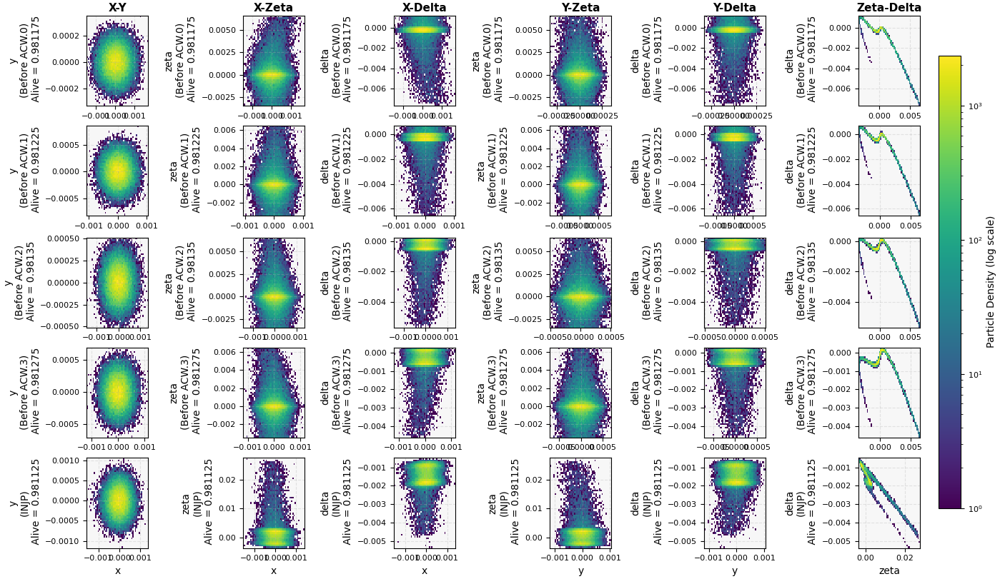

## Tuning the BTe (ECS) and getting an approximate injection efficiency 

### Features in the following list of scripts
    - 002_dacomparison.py 
    - 003_scan_lag_plotevery.py
    - 004_optimiser_for_lag.py
    - 005_optimiser_for_voltage.py
    - 006_optimise_lag_and_voltage.py
    
### User parameters

Taking into account the measured emittance blowup at the end of the line.

Emittance blowup:

    EMITTANCE_X_MEASURED = 140e-6/14000	    # Measured normalised horizontal emittance at BT2  
    EMITTANCE_Y_MEASURED = 140e-6/14000	    # Measured normalised vertical emittance at BT2  

Line configuration:

    Radiation = True                        # Enable radiation effects
    Tapering = True                         # Enable momentum tapering
    aperture_checks = True                  # Enables apertures in the line

ECS settings for 1D scan/optimiser:

    ECS_voltage = None	                    # Set a value in MV to enable else default is 18MV 
    ECS_lag= None	                        # Set a value in degrees to enable else default is 180° (zero crossing in Xsuite)  

ECS settings for 2D optimiser:

    set_voltage_bounds = (18E6, 100E6)      # VOLTAGE BOUNDS FOR THE OPTIMISER in VOLTS
    set_lag_bounds = (175, 185)             # LAG BOUNDS FOR THE OPTIMISER in DEGREES

Specify injection type:

Betatron injection: 

    BETATRON_OFFSET= 7.6e-3             # Set to 0 if pure synchrotron injection
    BETATRON_ANGLE_OFFSET= 0.6e-3       # Set to 0 if pure synchrotron injection

Synchrotron injection: 

    SYNCHROTRON_OFFSET_BT= 0.006            # In % with respect to the HER ring energy. Set to 0 for pure betatron injection 
    

The above scripts will:

- Track particles to the injection point (INJP)
- Transform coordinates to the CO bump frame.
- Calculate action amplitudes.
- Compare with DA in XY, ZX, ZY planes and the septum.
- Display plots showing surviving fractions and lost particles.
- The scan and 1D optimisers allow to show the surviving fraction as a function of ECS lag/voltage
- The 2D optimiser creates a map of ECS lag/voltage and displays survivability. 

Example output from 

     002_dacomparison.py 
with the following parameters:

    #Emittance blowup:
    EMITTANCE_X_MEASURED = 140e-6/14000	 # MEASURED EMITTANCE AT BTE2 IN NORMALISED
    EMITTANCE_Y_MEASURED = 140e-6/14000	 # MEASURED EMITTANCE AT BTE2 IN NORMALISED
    #Line configuration:
    Radiation = True 	                 # TRUE ENABLES RADIATION 
    Tapering = True 	                 # TRUE ENABLES TAPERING 
    aperture_check = True                # TRUE ENABLES APERTURE CHECKS DURING TRACKING
    #ECS settings:
    ECS_voltage = None	                 # SET A VALUE IN MV TO ENABLE ELSE DEFAULT IS 18MV
    ECS_lag= None	                     # SET A LAG IN DEGREES TO ENABLE ELSE DEFAULT IS 180° ZERO CROSSING IN XSUITE
    #Injection type
    #Betatron injection: 
    BETATRON_OFFSET= 0 # 7.6e-3              # SET TO 0 IF PURE SYNCHROTRON INJECTION
    BETATRON_ANGLE_OFFSET= 0 # 0.6e-3        # SET TO 0 IF PURE SYNCHROTRON INJECTION
    #Synchrotron injection 
    SYNCHROTRON_OFFSET_BT= 0.006       # IN % WITH RESPECT TO  HER ENERGY. SET TO 0 FOR BETATRON INJECTION

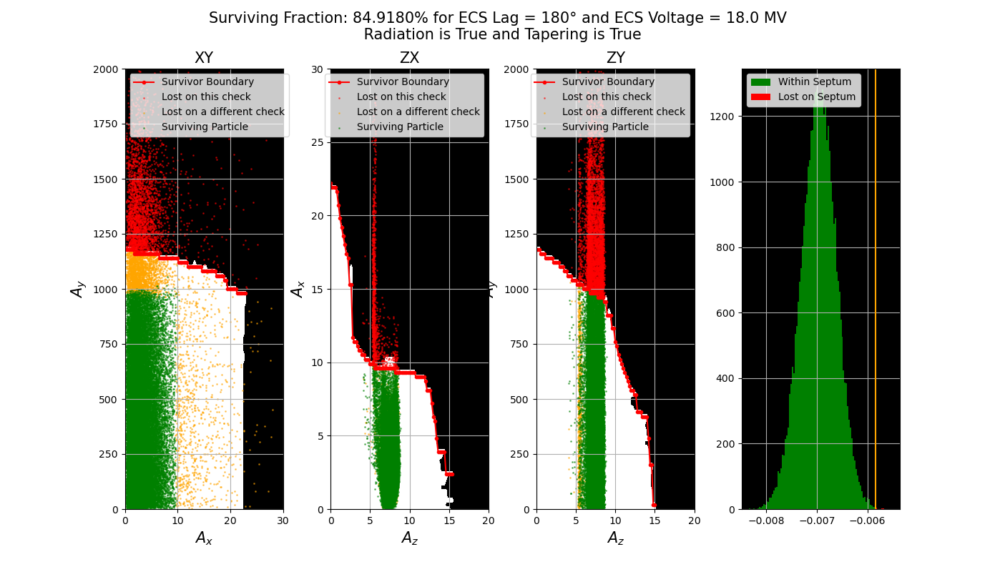

Example output from 

    004_optimiser_for_lag.py 

with the following parameters:

    #Emittance blowup:
    EMITTANCE_X_MEASURED = 140e-6/14000	 # MEASURED EMITTANCE AT BTE2 IN NORMALISED
    EMITTANCE_Y_MEASURED = 140e-6/14000	 # MEASURED EMITTANCE AT BTE2 IN NORMALISED
    #Line configuration:
    Radiation = True 	                 # TRUE ENABLES RADIATION 
    Tapering = True 	                 # TRUE ENABLES TAPERING 
    aperture_check = True                # TRUE ENABLES APERTURE CHECKING
    #ECS settings:
    ECS_voltage = None	                 # SET A VALUE IN MV TO ENABLE ELSE DEFAULT IS 18MV
    set_lag_bounds = (179, 180)          # BOUNDS FOR THE OPTIMISER

    #Injection type
    #Betatron injection: 
    BETATRON_OFFSET= 7.6e-3              # SET TO 0 IF PURE SYNCHROTRON INJECTION
    BETATRON_ANGLE_OFFSET= 0.6e-3        # SET TO 0 IF PURE SYNCHROTRON INJECTION
    #Synchrotron injection 
    SYNCHROTRON_OFFSET_BT= 0.00165       # IN % WITH RESPECT TO  HER ENERGY. SET TO 0 FOR BETATRON INJECTION

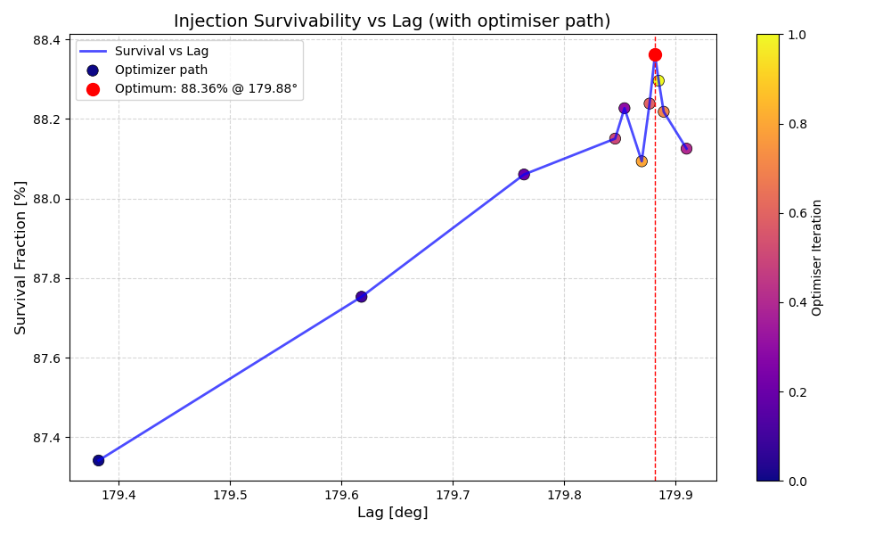

Injection efficiency for optimal lag settings: 

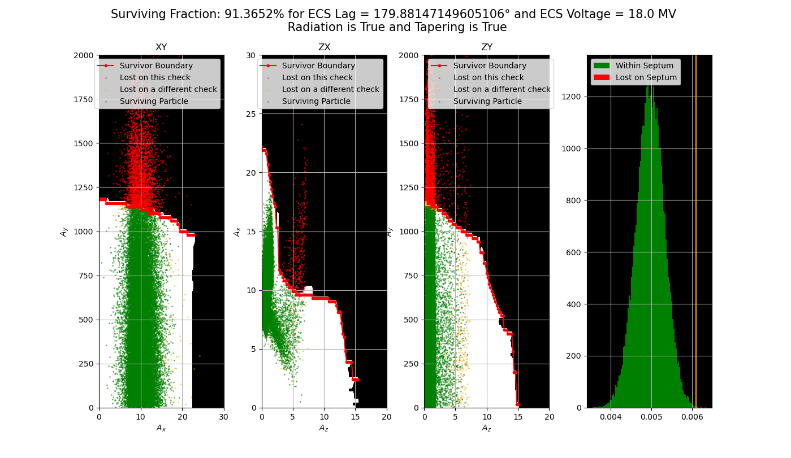

Example output from         
 
    006_optimise_lag_and_voltage.py 
 
with the following parameters:

    Emittance blowup:
    EMITTANCE_X_MEASURED = 140e-6/14000	 # MEASURED EMITTANCE AT BTE2 IN NORMALISED
    EMITTANCE_Y_MEASURED = 140e-6/14000	 # MEASURED EMITTANCE AT BTE2 IN NORMALISED
    #Line configuration:
    Radiation = True 	                 # TRUE ENABLES RADIATION 
    Tapering = True 	                 # TRUE ENABLES TAPERING 
    #ECS settings:
    ECS_lag = None                       # SET A VALUE IN DEGREES TO ENABLE ELSE DEFAULT IS 108° ZERO CROSSING IN XSUITE
    set_voltage_bounds = (18E6, 100E6)   # VOLTAGE BOUNDS FOR THE OPTIMISER in VOLTS
    set_lag_bounds = (175, 185)          # LAG BOUNDS FOR THE OPTIMISER in DEGREES
    aperture_check = True                # TRUE ENABLES APERTURE CHECKING

    #Injection type
    #Betatron injection: 
    BETATRON_OFFSET= 7.6e-3              # SET TO 0 IF PURE SYNCHROTRON INJECTION
    BETATRON_ANGLE_OFFSET= 0.6e-3        # SET TO 0 IF PURE SYNCHROTRON INJECTION
    #Synchrotron injection 
    SYNCHROTRON_OFFSET_BT= 0.00165       # IN % WITH RESPECT TO  HER ENERGY. SET TO 0 FOR BETATRON INJECTION

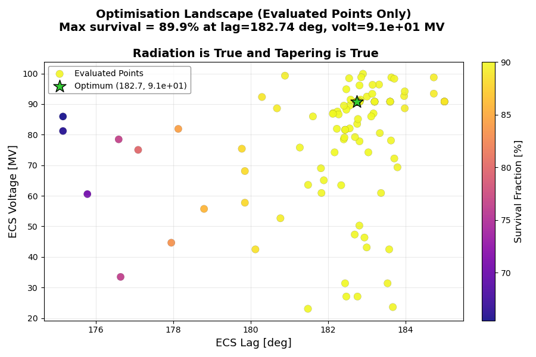

### Additional material

Additionally, the following two scripts provide an insight into the BTe emittance evolution along the line

without any errors 
    
    007_track_emittances_along_line.py

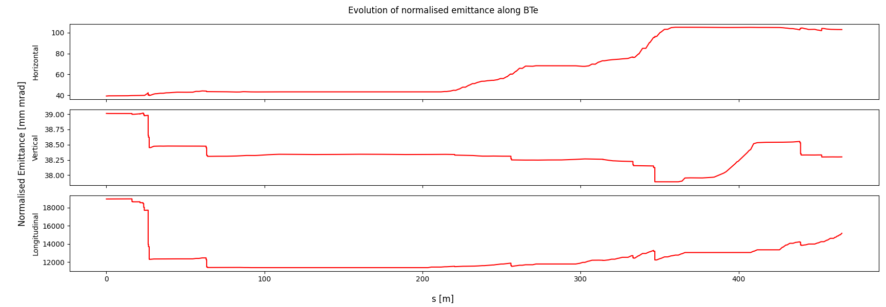

and by introducing quadrupole alignment errors

    008_emittances_errors.py

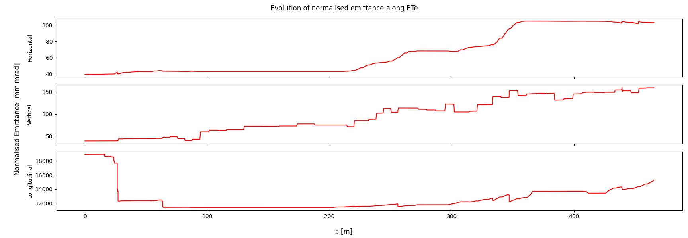

For the positron transfer line (BTp) 

    001_phasespace_BTP.py 

allows to track particles from "pbtp" to "injp" with adaptive user parameters. 

## Assumptions in the model
There are some fundamental assumption being made it in this approximation some of the most significant ones are listed below: 

- DA/MA unaffected by orbit bump
- Bump is tuned to match the target delta and the ring dispersion values
- Septum position known to 100um precision 
- All BTe ECS cavities share same power converter (i.e. same lag, voltage etc.)
- INJP at same longitudinal position as INJECTIO (edge of the septum)
- Injection angles/offsets purely horizontal
- Beam losses at the septum are accounted for

#### The DA/MA are provided by Xsuite tracking of the HER and are imported into the scripts 

It is noted that several different optics for the ring lattice are referenced in the scripts

- 200_8mm
- 100_3mm

These are from recent SAD lattices as provided by K. Oide and DA/MA are simulated in Xsuite (J. Salvesen)

## Project Status

This project has been tested for SuperKEKB BTE lattices, including for energy offsets at injection and emittance blowup scenarios. 

## Authors and acknowledgment

Written by Nikita Z van Gils in the context of a month long EAJADE secondment at SUPERKEKB.

With thanks to:

John Salvesen for his guidance on the lattice conversions and support on setting up this project 

Takashi Mori and Naoko Iida for their vital support on this project

Katsunobu Oide for his discussions and expertise on SAD

Andrea Aguirre and Giulia Nigrelli for their discussions regarding the start and end of BT 

EAJADE for funding support

### EAJADE
This work was partially supported by the European Union's Horizon Europe Marie Sklodowska-Curie Staff Exchanges programme under grant agreement no. 101086276.

### SAD
With thanks to all the developers of SAD.
The SAD documentation was used extensively in this comparison, available at [SAD](https://acc-physics.kek.jp/SAD/).
The version of SAD used in comparisons is Katsunobu Oide's version, available at [SAD GitHub](https://github.com/KatsOide/SAD).

### Xsuite
With thanks to all the developers of Xsuite.
The Xsuite documentation was used extensively in this comparison, available at [Xsuite](xsuite.readthedocs.io/).
The version of Xsuite used in comparisons is the latest version, available at [Xsuite GitHub](https://github.com/xsuite).

## SAD2XS

This project relied on the SAD2XS converter written by John Salvesen.
The package is available at [SAD2XS](https://pypi.org/project/sad2xs/).

For referencing, please refer to:
"CONSISTENT REPRESENTATION OF LATTICES BETWEEN OPTICS CODE FOR FCC-ee SUPERKEKB AND MORE"
J. Salvesen, G. Iadarola, G. Broggi, H. Sugimoto, K. Oide, G. Roy, A. Oeftiger

## Support
For any questions or further discussion, please contact nikita.zena.van.gils@cern.ch with queries.

For any questions regarding the lattice conversions, please contact john.salvesen@cern.ch
